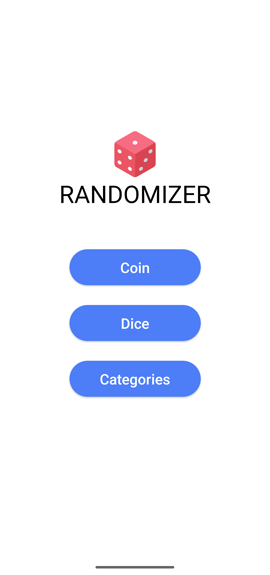
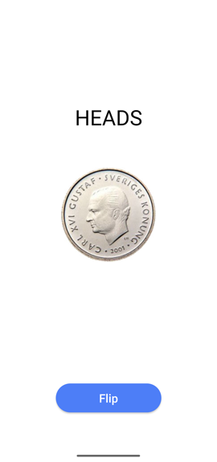
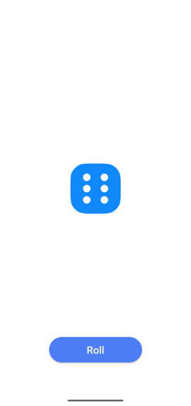
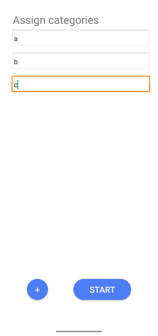

# Randomizer App
Flip a coin, roll a dice, or pick a category! A lightweight app with a few randomization features.

 

 

# Installation
To install this app on your Android mobile device, go to [releases](https://github.com/carlbodin/randomizerapp/releases), choose the latest, and download the APK. Make sure that you have enabled the permission to install apps outside of Google Play Store, see setting "Install unknown apps", for the app you are launching the APK from. The APK can be deleted after installation. Enjoy!

# License
Free to use.